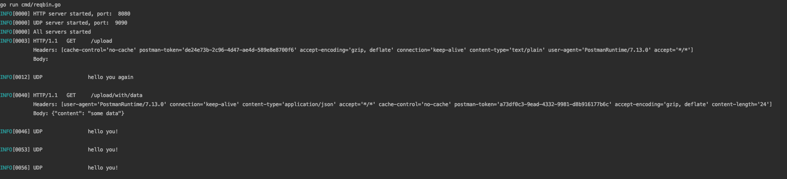

# GoReqBin

### A simple http and udp requests logger

Logger for received requests. Currently supports UDP and HTTP protocols. May be used as a substitution for logstash container during the development or just for testing what request are being sent from your application and how it look like.



## Configuration

You may configure what servers to start by specifying the env variables before running this program.

Available env variables:
```
HTTP_ENABLED=true  | will run http server
HTTP_PORT=8080     | run http server on port 8080

UDP_ENABLED=true   | will run udps server
UDP_PORT=9090      | run udp server on port 9090  
```

Example configuration: `HTTP_ENABLED=false UDP_ENABLED=true UDP_PORT=9000`. Will start just the udp server on port 9000.

## How to run

#### - using local go

`go run cmd/reqbin.go` 

or override default configuration

`HTTP_ENABLED=false UDP_ENABLED=true UDP_PORT=9000 go run cmd/reqbin.go`

#### - via docker

`docker run -it -p 8080:8080 -9090:9090 kedlas/goreqbin:latest`

or override default configuration

`docker run -it -p 9000:9000 -e HTTP_ENABLED=false UDP_ENABLED=true UDP_PORT=9000 kedlas/goreqbin:latest`
